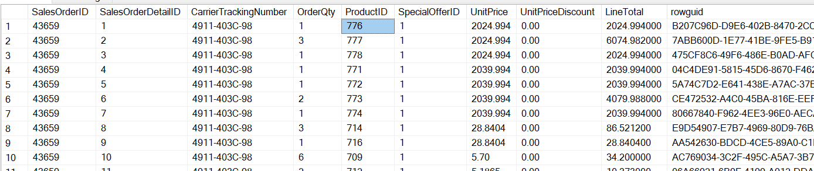
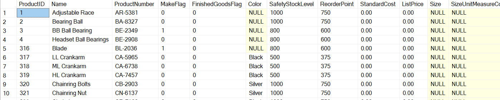
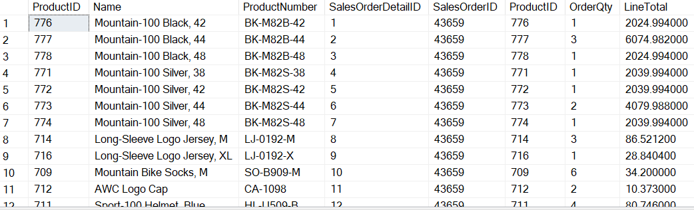
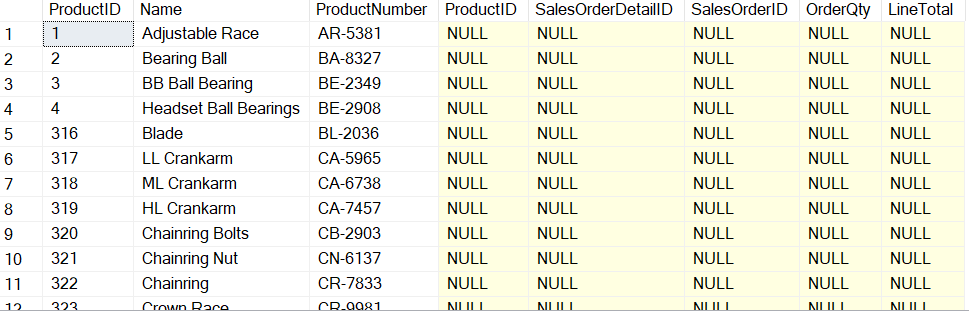

# Joins

#### Inner Join
Inner Join joins two tables on select column(s) and display only matched records. Inner join is the default join unless mentioned otherwise.

Let's observe these two tables

SalesOrderDetail


Product



We can see `productID` is a column that exists in both tables and these tables can be joined on this column.

```
SELECT 
	P.ProductID, P.Name, P.ProductNumber,
	S.ProductID, S.SalesOrderDetailID, S.SalesOrderID, S.OrderQty, S.LineTotal
FROM 
	Production.Product P, Sales.SalesOrderDetail S
WHERE
	P.ProductID = S.ProductID;
```


Above query can also be written as below

```
-- SELECT P.ProductID, P.Name, P.ProductNumber FROM Production.Product P;
-- SELECT S.SalesOrderDetailID, S.SalesOrderID, S.ProductID, S.OrderQty, S.LineTotal FROM Sales.SalesOrderDetail S;

SELECT 
	P.ProductID, P.Name, P.ProductNumber,
	S.ProductID, S.SalesOrderDetailID, S.SalesOrderID, S.OrderQty, S.LineTotal
FROM 
	Production.Product P
JOIN
	Sales.SalesOrderDetail S
ON
	P.ProductID = S.ProductID
;
```
-- SELECT P.ProductID, P.Name, P.ProductNumber FROM Production.Product P;
-- SELECT S.SalesOrderDetailID, S.SalesOrderID, S.ProductID, S.OrderQty, S.LineTotal FROM Sales.SalesOrderDetail S;

SELECT 
	P.ProductID, P.Name, P.ProductNumber,
	S.ProductID, S.SalesOrderDetailID, S.SalesOrderID, S.OrderQty, S.LineTotal
FROM 
	Production.Product P
INNER JOIN
	Sales.SalesOrderDetail S
ON
	P.ProductID = S.ProductID
;
```
```


#### Left Join
Left join joins two tables on selected colun(s) and displays matched records along with all records from left mentioned table. For the records that doesn't have a match, records from right mentioned table will be shown as NULL.

```
SELECT 
	P.ProductID, P.Name, P.ProductNumber,
	S.ProductID, S.SalesOrderDetailID, S.SalesOrderID, S.OrderQty, S.LineTotal
FROM 
	Production.Product P
LEFT JOIN
	Sales.SalesOrderDetail S
ON
	P.ProductID = S.ProductID
ORDER BY P.ProductID
;
```

