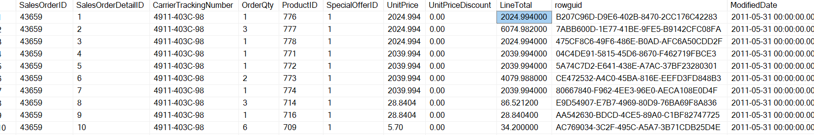
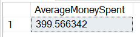

# Sales Orders Analysis

####

Explore Sales orders table

```
select * from sales.SalesOrderDetail;
```



Here we see `LineTotal` column is showing the total amount spent in that order and `OrderQty` column is showing the number of items in that order. 


Let's find the average money spent on each order.
Average money spent = Total money spent / no. of items in all orders

```
SELECT (SUM(LineTotal) / SUM(OrderQty)) as AverageMoneySpent from SALES.SalesOrderDetail;
```


